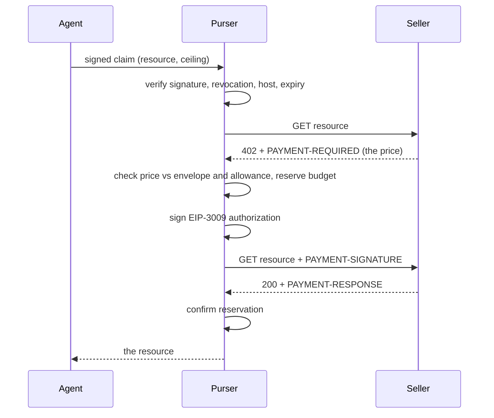

# Purser

A local daemon that holds the wallet key and decides whether an agent may spend, so the agent cannot decide for itself.

Purser sits between your agents and the [x402](https://x402.org) payment protocol. Agents ask it for a resource. It fetches the seller's price itself, checks that price against a policy envelope, signs if the policy allows, replays the request, and records what actually happened. The agent never holds the key, never supplies the price, and never reports its own outcome.

- [Why it exists](#why-it-exists)
- [Status](#status)
- [What it claims, and what it does not](#what-it-claims-and-what-it-does-not)
- [Install](#install)
- [Quickstart](#quickstart)
- [How it works](#how-it-works)
- [CLI reference](#cli-reference)
- [Wire protocol](#wire-protocol)
- [Security model](#security-model)
- [Removing it](#removing-it)
- [Development](#development)

## Why it exists

The usual advice for agent payments is to put a spend limit on the agent's wallet and let the agent compare the price against its budget before it pays.

That works right up to the moment the agent is the thing you are worried about. An agent runs in a process you do not control, reading responses from services you did not write, with a context window anyone upstream can influence. If the agent compares the price to the rules, the agent is enforcing the rules. A prompt injection, a parsing bug, or a confused retry is then indistinguishable from policy.

Purser moves the comparison out of the agent. The agent states what it wants and the most it is willing to pay. Everything after that happens in a process the agent cannot reach.

There is a longer argument in [docs/articles/who-told-the-agent.md](docs/articles/who-told-the-agent.md).

## Status

**Version 0.1. Working, tested, and not yet proven with real money.**

The policy path is exercised by 126 tests including an adversarial suite, and `pnpm smoke` drives the built binary over a real unix socket against a local seller. Every payment to date has been against a stub or a local server. No authorization signed by Purser has ever been broadcast to a chain.

Do not put funds behind this yet. The API will change without ceremony before 1.0.

## What it claims, and what it does not

Being precise about this matters more than the feature list, because a spend limit that quietly does not hold is worse than no spend limit at all.

### It claims

| Claim | Mechanism |
| --- | --- |
| The agent never sees the wallet key | The key is read from stdin into the daemon's memory. Agents talk to it over a socket. |
| The price is never supplied by the agent | The quote is parsed from the seller's own `PAYMENT-REQUIRED` response at decision time. The agent supplies only a ceiling. |
| One agent cannot spend as another | Every request carries an Ed25519 signature over the claim, verified against that agent's registered public key. |
| One agent cannot exhaust the account | Per-agent envelopes are bounded by a pooled account allowance that every agent shares. |
| Revoking one agent does not stop the others | Revocation is per agent. The rest keep working. |
| A refusal costs nothing | Budget is reserved before signing, and released if anything after that fails. |
| A retry cannot inherit an approval | Intents and attempts are separate. Each attempt is checked against a fresh quote. |
| Settlement is observed, not reported | The daemon replays the paid request itself and reads the response directly. |
| A lost settlement does not silently free budget | An indeterminate outcome enters `in_doubt` and keeps consuming the allowance until reconciled. |

### It does not claim

- **This is not on-chain enforcement.** Purser decides whether to sign. Once an EIP-3009 authorization is signed, it is valid until it expires and the chain knows nothing about your envelope. Enforcement exists at the moment of signing and nowhere else. On-chain limits would need a smart contract account, which this is not.
- **It does not protect a key that is already elsewhere.** If an agent has your private key by some other route, Purser is irrelevant.
- **It does not govern other rails.** If a paid tool call causes a second payment through some other authority, that payment never passes this envelope. Only what routes through Purser is bounded by it.
- **It does not stop a seller overcharging within your ceiling.** If you authorise up to 5 USDC and the seller quotes 4.99, that is a valid payment. Envelopes bound exposure, they do not negotiate.
- **There is no human approval path in v1.** Every request gets a terminal yes or no from policy alone. Nothing pauses for a person.
- **It has not been audited.** One author, no external security review.
- **The signer still holds the key in memory.** It is a far smaller and better contained process
  than the daemon, with no network access, but it is not a hardware boundary. A YubiHSM 2 supports
  secp256k1 and fits the same seam when that matters. TPM 2.0 and YubiKey PIV do not; both are NIST
  curve devices and cannot sign secp256k1.
- **A compromised daemon can spend up to the signer's limits and choose the recipient.** Per agent
  envelopes do not constrain it, because it is the component that enforces them. As of 0.1.0 the
  signer has no cumulative limit, so that is a per payment ceiling repeated as often as the attacker
  likes.
- **Nothing detects a drain today.** There is no audit trail and no alerting, so time to detect is
  bounded only by how often you look.
- **It serves one principal and one wallet.** Multi-tenancy is not implemented, and `principalId` is currently hardcoded.
- **Envelopes are fixed at issue time.** Changing a limit means revoking the agent and issuing a new one.

## Install

Requires Node 24 or later, for `node:sqlite`.

```bash
git clone https://github.com/RegardV/x402-purser.git
cd x402-purser
pnpm install
pnpm build
```

Then either `node dist/cli.js` or `npm link` to get a `purser` command.

## Quickstart

**1. Create the account and set the allowance every agent shares.**

Amounts are in atomic units. For USDC, 6 decimals, so `100000` is 0.10 USDC.

```bash
purser init --allowance 100000 --period 3600 --currency USDC
```

**2. Issue an agent.**

```bash
purser agent add scraper \
  --cap 50000 --per-tx 5000 --period 3600 \
  --hosts api.example.com --currencies USDC
```

This prints the agent's reference and its private key. The key is shown **once** and is not recoverable. Give it to the agent; if you lose it, revoke and issue a new one.

**3. Start the daemon.**

The wallet key is read from stdin. Never pass it as a flag.

```bash
pass show wallet/base | purser run          # or paste it at the prompt
```

**4. Have the agent ask for something.**

The agent signs a claim with the key from step 2 and writes one line of JSON to the socket. See [wire protocol](#wire-protocol). `scripts/smoke.mjs` is a complete worked example.

## How it works



The order matters in three places.

**Authentication happens before the fetch,** not before the payment. A free resource must not be a way to skip the signature check, or the socket becomes an unauthenticated fetch proxy for anyone who can reach it, revoked agents included.

**Budget is reserved before signing,** so concurrent requests cannot both spend the last of the allowance. If signing fails, the reservation is released rather than left holding budget for a payment that will never happen.

**Purser replays the request,** rather than handing a signed payload back to the agent. This is what makes the ledger a record of what was observed instead of what the agent said happened.

### Policy model

An **envelope** is what one agent may do: a spend cap over a rolling period, a per-transaction maximum, an allowlist of hosts, an allowlist of currencies, and an optional expiry.

An **allowance** is the pool all agents share. Every envelope is bounded by it at issue time, and committed spend is summed across the whole account, so three agents with 50000 caps against a 100000 allowance cannot spend 150000 between them.

An **intent** is one thing the agent wants to buy, up to a ceiling. An **attempt** is one signed try against one specific quote. A re-quote is a new attempt, checked from scratch. It never inherits the decision that admitted the previous one.

## CLI reference

| Command | What it does |
| --- | --- |
| `purser init --allowance N --period S --currency C` | Creates the account and sets the shared allowance. Idempotent. |
| `purser agent add <label> --cap N --per-tx N --period S --hosts a,b --currencies C [--expires ISO]` | Issues an agent and prints its private key once. |
| `purser agent list [--all]` | Lists agents. `--all` includes revoked ones. |
| `purser agent revoke <agent_ref>` | Revokes an agent and everything issued beneath it. |
| `purser run [--socket PATH] [--signer-socket PATH]` | Starts the daemon. With `--signer-socket` the key never enters this process; without it, the key is read from stdin. |
| `purser-signer --tokens 0x.. --chains 8453 --max-value N [--socket PATH]` | Starts the signer. Reads the wallet key from stdin and never releases it. |

All amounts are atomic units. `--db` or `PURSER_DB` overrides the database path, which defaults to `~/.purser/purser.db`. The socket defaults to `~/.purser/purser.sock`.

## Wire protocol

Newline-delimited JSON over a unix socket, one object per request. Small enough to inspect with `nc`.

**Request**

```json
{
  "v": 1,
  "agentRef": "tHrQ7PFWdw3knyz5LPm00A",
  "resourceUrl": "https://api.example.com/thing",
  "ceilingAtomic": "2000",
  "currency": "USDC",
  "nonce": "unique-per-request",
  "timestamp": "2026-08-11T09:00:00.000Z",
  "signature": "<base64 Ed25519 over the canonical claim>"
}
```

The signature covers every field except itself. Timestamps more than 60 seconds from the daemon's clock are refused, so a captured request cannot be replayed later.

**Response**

One of:

```json
{"v":1,"status":"paid","body":"...","decision":{...}}
{"v":1,"status":"free","body":"..."}
{"v":1,"status":"refused","reason":"refused (exceeds_intent_ceiling): 1000 > 10"}
{"v":1,"status":"seller_error","httpStatus":503}
```

Refusal reasons are stable strings: `bad_signature`, `agent_revoked`, `stale_claim`, `envelope_expired`, `host_not_allowed`, `currency_not_allowed`, `exceeds_intent_ceiling`, `exceeds_per_transaction_limit`, `insecure_scheme`.

## Security model

**What Purser assumes.** The agent is untrusted and may be fully compromised. The operator's user account is trusted. The seller is untrusted but is the only source of prices.

**Key custody.** In the recommended deployment the wallet key is not in the Purser daemon at all.
It lives in a separate `purser-signer` process, running as a different user with no network
namespace, which will only ever sign an EIP-3009 transfer authorization. Purser sends structured
typed data over a socket and gets a signature back, and cannot ask for a signature over an
arbitrary hash. That rules out native currency transfers, `approve` calls, and arbitrary contract
calls. It is stronger than a cloud KMS, which signs whatever digest it is given and can only
restrict who calls it.

**What that does not rule out, as of 0.1.0.** The signer enforces a per payment ceiling and has no
cumulative limit, so a compromised daemon can request many in-policy signatures in a row and drain
the token balance a ceiling at a time. This was found by audit on 2026-08-16 and is being fixed by
giving the signer a persisted windowed total. Until then, treat the per payment ceiling as the only
signer side limit and size the wallet accordingly.

**What actually bounds your loss.** Fund the signing wallet with only what you can afford to lose
in one incident, topped up from a cold reserve out of band. The token contract will not transfer
what is not there, which makes the hot balance the one control that does not depend on Purser being
correct. Everything else here reduces blast radius and shortens time to detect. See the
[threat model](docs/superpowers/specs/2026-08-16-threat-model.md) for the adversaries each control
answers and for the residual risk.

Running `purser run` without `--signer-socket` keeps the key in the daemon, read from stdin. That is
fine for development and is the weaker configuration. In either case the key is never accepted as a
flag or an environment variable: flags land in shell history and `ps` output, and environment
variables are inherited by every child process, which here would mean the agents the daemon exists
to constrain.

See [deploy/README.md](deploy/README.md) for the two user setup and the hardened unit.

**Socket permissions are the access control.** The socket is created `0600`, so only the owning user can connect. Anyone who can reach the socket can still only act as an agent whose key they hold.

**Agent keys.** Issued once and never stored in recoverable form. Purser keeps the public key. A leaked agent key is contained by that agent's envelope and revoked with one command.

**Transport.** Only `https` resources are payable, except loopback addresses, which are allowed for local development.

To report a vulnerability, see [SECURITY.md](SECURITY.md).

## Removing it

Purser writes to exactly two places, both under `~/.purser` by default.

```bash
purser agent list                 # note anything still live
purser agent revoke <agent_ref>   # revoke agents before removing the record of them
rm -rf ~/.purser                  # database and socket
npm uninstall -g x402-purser      # if you linked it
```

The database holds agent public keys, envelopes, and the spend ledger. It does not hold your wallet key, so there is nothing to shred beyond ordinary file deletion. Deleting the database does **not** revoke anything already signed: authorizations Purser has already issued remain valid until they expire. If you are removing Purser because a key was exposed, move the funds.

## Development

```bash
pnpm test         # 126 tests
pnpm typecheck
pnpm build
pnpm smoke        # end to end against a local stub seller
```

The adversarial suite in `test/adversarial.test.ts` is the one that matters. Its premise is that an agent fully controls its own process and still cannot exceed its envelope. It includes a control case that must actually pay, because a payment harness that silently stops paying makes every refusal test pass for the wrong reason.

## License

MIT. See [LICENSE](LICENSE).

Purser is an independent project. It is not affiliated with, endorsed by, or supported by the x402 maintainers, Coinbase, or any payment provider. The `x402-` prefix describes the protocol it speaks, nothing more.
